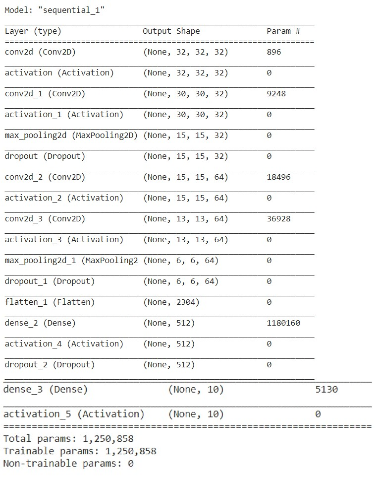
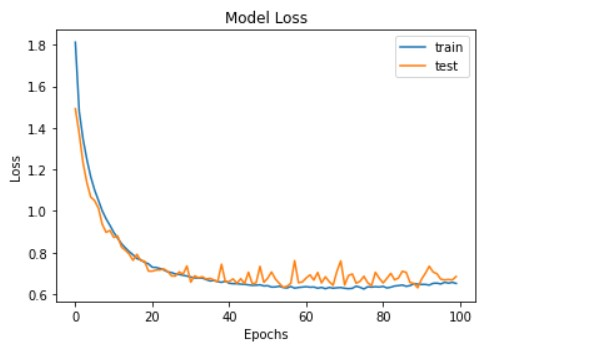
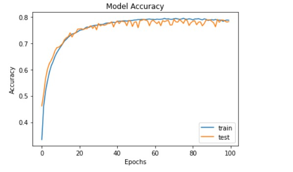
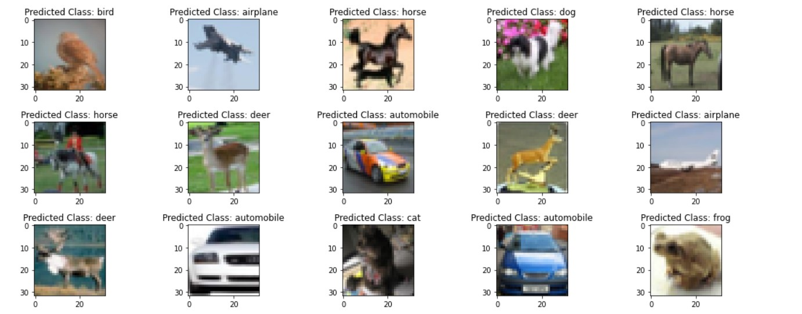

[](https://www.python.org/)

# CIFAR10 Classification using Convolutional Neural Networks

## Overview
Convolutional Neural Networks Model is created to classify the CIFAR10 dataset into 10 categories
* Airplane
* Automobile
* Bird
* Cat
* Deer
* Dog
* Frog
* Horse
* Ship
* Truck

## Dataset
CIFAR10 dataset is taken from `tensorflow.keras.datasets`. 

## Model
<p align="left">
 &ensp;&ensp;&ensp;&ensp;&ensp;&ensp;&ensp;&ensp;&ensp;
</p>

## Performance
<p align="left">
 &ensp;&ensp;&ensp;&ensp;&ensp;&ensp;&ensp;&ensp;&ensp;
 &ensp;&ensp;&ensp;&ensp;&ensp;&ensp;&ensp;&ensp;&ensp;
</p>

## Prerequisites
* Python 3 
* an IDE (preferably Google Colab)
* Pandas 
* Numpy 
* Matplotlib 
* Seaborn
* Sklearn
* Keras
* Tensorflow
* OpenCV


All the external dependencies can be installed by using ```pip install -r requirements.txt```

## Results
<p align="left">
 &ensp;&ensp;&ensp;&ensp;&ensp;&ensp;&ensp;&ensp;&ensp;
</p>

## Demo
Please refer to the colab notebook <a href = "https://colab.research.google.com/drive/1gg7dLyNg7evfdw4QbOByIOchuZdN77C_?usp=sharing">here</a> 

## Author
* Rishikesh Sivakumar

[](https://GitHub.com/Naereen/) by [Rishikesh Sivakumar](https://www.linkedin.com/in/rishikesh-sivakumar-1a166a18b/)

